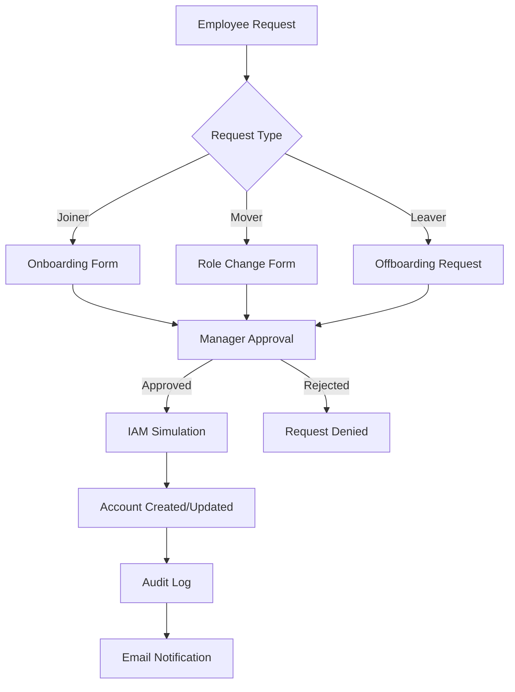

# IdentityFlow Automation Platform

A **Hackathon-ready Self-Service Identity Lifecycle Automation Platform** that automates the **Joiner–Mover–Leaver (JML) employee lifecycle**. The platform simulates enterprise Identity and Access Management workflows while remaining **fully safe (no connection to real IAM systems)**.

## Demo Link
[Watch Demo](https://drive.google.com/file/d/1HtKJLOQKcqELJbxl47tk2GXGitm-wLnQ/view?usp=sharing)
## LIVE LINK
[Visit](https://identityflow-automation-p6bz.vercel.app/)
## 📋 Problem Statement

Organizations struggle with manual identity lifecycle management leading to:
- Delayed employee onboarding
- Incorrect access permissions
- Security vulnerabilities from orphaned accounts
- Lack of audit compliance
- Inefficient approval processes

## 💡 Solution Overview

A comprehensive platform that automates JML processes with:
- **Self-service employee portal**
- **Manager approval workflows**
- **Simulated IAM integrations**
- **Role-based access control**
- **Audit logging and analytics**
- **AI-powered chatbot assistant**

## 🏗️ Architecture

```
Frontend (Next.js 14)
├── Dashboard & Analytics
├── Employee Management
├── Approval Workflows
├── Access Requests
├── Chatbot Assistant
└── Audit Logs

Backend (Next.js API Routes)
├── /api/onboard - Employee onboarding
├── /api/move - Role/department changes
├── /api/leaver - Account deactivation
├── /api/approve - Request approvals
└── /api/access-request - Access requests

Core Services
├── Mock IAM Service - Simulated identity operations
├── Workflow Engine - Approval processes
└── Audit Logger - Activity tracking
```

## 🔄 Joiner–Mover–Leaver Workflow



## ✨ Key Features

### 🔐 Role-Based Access Control
- **Admin**: Full system management
- **Manager**: Approve requests, view team
- **Employee**: Submit requests, view status

### 📊 IAM Analytics Dashboard
- Real-time employee statistics
- Role distribution charts
- Pending approvals counter
- Recent activity feed

### 🤖 Chatbot Assistant
- Natural language commands
- Guided workflows
- Status inquiries

### 🔄 Approval Workflow Engine
- Multi-step approvals
- Status tracking
- Automated notifications

### ⏰ Access Expiration
- Temporary access grants
- Automatic revocation
- Expiration alerts

### 📋 Access Request System
- Resource-specific requests
- Duration-based access
- Approval routing

## � Advanced Hackathon Features

### 🔍 Identity Risk Detection Engine
**Real enterprise security intelligence that judges love!**

- **Orphaned Accounts**: Detects inactive employees with active accounts
- **Privilege Escalation**: Alerts on sudden admin role assignments
- **Dormant Accounts**: Identifies users inactive for 90+ days
- **Role Change Frequency**: Flags users with multiple role changes

**UI Integration**: Security Alerts panel in dashboard with severity levels

### 📋 Automated Access Review Campaigns
**Compliance feature that shows regulatory awareness**

- Create quarterly/periodic access review campaigns
- Manager reviews employee permissions for each team member
- Approve/revoke unnecessary access rights
- Track campaign completion and overdue reviews

**Real-world parallel**: SailPoint, Saviynt, Oracle Identity Governance

### 🤖 Natural Language AI Assistant
**Command-based IAM operations with multi-step conversations**

**Example Interactions:**
```
User: Onboard new employee
Bot: Please provide employee details in this format:
     Name: [name]
     Email: [email]
     Department: [department]
     Role: [role]
     Manager: [manager]

User: Name: Rahul
     Email: rahul@company.com
     Department: Engineering
     Role: Developer
     Manager: John Smith

Bot: ✅ Onboarding request submitted successfully! Waiting for manager approval.
```

**Smart Commands:**
- `"Change role of John"` → Interactive role update
- `"Deactivate employee Jane"` → Confirmation workflow
- `"Show pending approvals"` → Lists current requests
- `"List employees in engineering"` → Department filter
- `"Show audit log"` → Recent activity summary

## �🛠️ Tech Stack

- **Frontend**: Next.js 14 (App Router), React, TypeScript, TailwindCSS
- **Backend**: Next.js API Routes (Serverless)
- **Data Storage**: In-memory JSON (simulated)
- **Charts**: Recharts
- **Deployment**: Vercel
- **Styling**: TailwindCSS

## 🚀 Installation & Setup

### Prerequisites
- Node.js 18+
- npm or yarn

### Local Development

1. **Clone the repository**
   ```bash
   git clone https://github.com/yourusername/identityflow-automation.git
   cd identityflow-automation
   ```

2. **Install dependencies**
   ```bash
   npm install
   ```

3. **Run development server**
   ```bash
   npm run dev
   ```

4. **Open browser**
   ```
   http://localhost:3000
   ```

### Vercel Deployment

1. **Connect to Vercel**
   ```bash
   npx vercel
   ```

2. **Deploy**
   ```bash
   npx vercel --prod
   ```

## 📱 Usage Guide

### Employee Onboarding
1. Navigate to Employees → Add Employee
2. Fill onboarding form
3. Submit for manager approval
4. Track status in dashboard

### Role Changes
1. Submit role change request
2. Manager reviews and approves
3. System updates permissions
4. Audit log created

### Access Requests
1. Request specific resources
2. Set access duration
3. Approval workflow
4. Automatic expiration

## 🔍 API Endpoints

| Endpoint | Method | Description |
|----------|--------|-------------|
| `/api/onboard` | POST | Submit onboarding request |
| `/api/move` | POST | Submit role change request |
| `/api/leaver` | POST | Submit offboarding request |
| `/api/approve` | POST | Approve/reject requests |
| `/api/access-request` | POST | Submit access requests |

## 📊 Dashboard Screenshots

### Home page


### Main Dashboard


### Approval Workflow


### Chatbot Interface


## 🤝 Contributing

1. Fork the repository
2. Create feature branch (`git checkout -b feature/amazing-feature`)
3. Commit changes (`git commit -m 'Add amazing feature'`)
4. Push to branch (`git push origin feature/amazing-feature`)
5. Open Pull Request

## 📄 License

This project is licensed under the MIT License - see the [LICENSE](LICENSE) file for details.

## 🙏 Acknowledgments

- Built for hackathons and demonstrations
- Simulates enterprise IAM workflows safely
- Inspired by modern identity governance platforms

---

**Note**: This is a simulation platform for educational and demonstration purposes. It does not connect to real IAM systems or production environments.
- Revoke access permissions
- Log the action in the audit system

## 4. Approval Workflow
- Requests are marked as **Pending**
- Admin/Manager can **Approve or Reject**
- Approved actions trigger simulated IAM operations

## 5. IAM Simulation Layer

Mock IAM APIs simulate identity management operations:

- `createUser()`
- `assignRole()`
- `revokeAccess()`
- `disableAccount()`

These functions simulate real IAM delays and responses.

## 6. Chatbot Assistant

A simple chatbot helps users perform actions such as:

- "Onboard a new employee"
- "Change role"
- "Deactivate employee"

The chatbot guides users through the workflow.

## 7. Audit Logs

All actions are recorded with:

- Timestamp
- Action type
- Employee
- Status
- Approver

This provides **traceability and compliance visibility**.

---

# Tech Stack

**Frontend**
- Next.js 14
- React
- TailwindCSS
- TypeScript

**Backend**
- Next.js API Routes (Serverless)

**Deployment**
- Vercel

**Other**
- Mock IAM simulation layer
- In-memory / JSON data storage

---

# Project Architecture

```
User / Admin
     |
     v
Self-Service Portal / Chatbot
     |
     v
Approval Workflow System
     |
     v
Mock IAM API Layer
     |
     v
Audit Logging System
```

---

# Project Structure

```
/app
   /dashboard
   /employees
   /approvals
   /chatbot

/api
   /onboard
   /move
   /leaver
   /approve

/lib
   mockIAM.ts

/components
   EmployeeTable.tsx
   ApprovalCard.tsx
   ChatbotWidget.tsx
   AuditLog.tsx
```

---

# Installation

Clone the repository:

```bash
git clone https://github.com/yourusername/identity-lifecycle-automation.git
cd identity-lifecycle-automation
```

Install dependencies:

```bash
npm install
```

Run the development server:

```bash
npm run dev
```

Open in browser:

```
http://localhost:3000
```

---

# Deployment (Vercel)

1. Push the project to GitHub
2. Go to **Vercel**
3. Import the repository
4. Click **Deploy**

Vercel will automatically detect the **Next.js project** and deploy it.

---

# Example Workflow

### Onboarding

1. Employee onboarding request submitted
2. Manager approval required
3. IAM simulation creates account
4. Role assigned
5. Audit log updated

### Role Change

1. Role change request submitted
2. Approval workflow triggered
3. Permissions updated

### Offboarding

1. Deactivation request
2. IAM simulation disables account
3. Access revoked
4. Audit recorded

---

# Security Considerations

- No real IAM system is connected
- APIs are simulated
- Designed only for **demonstration and learning**

---

# Future Improvements

- Integrate with real IAM providers (Okta, Azure AD)
- Add RBAC access control
- Add database (PostgreSQL / MongoDB)
- AI-powered chatbot
- Slack / Teams integration
- Email notification system

---

# Author

Harshitha Arava

---

# License

MIT License
